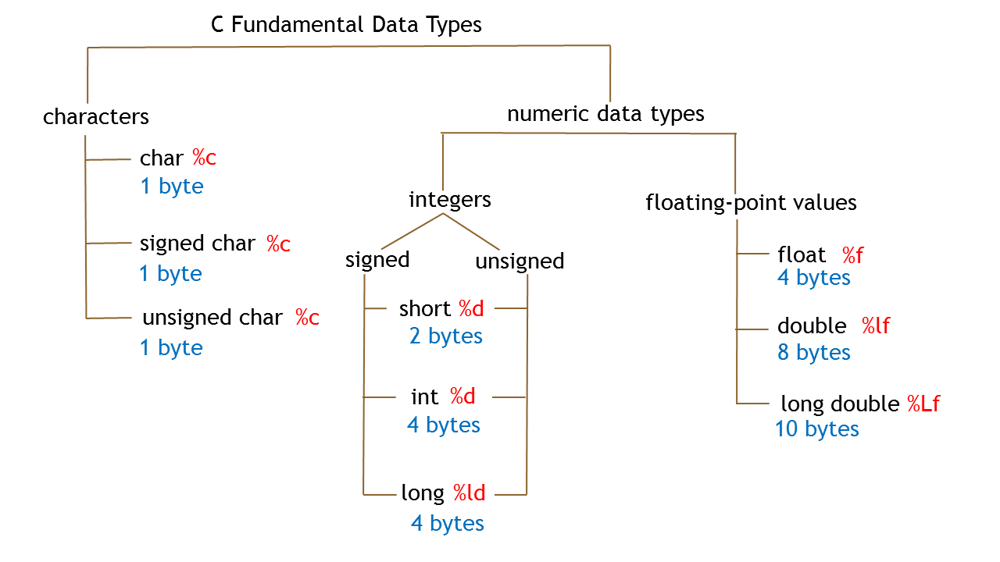

# W02 Notes // 02.10.19

## Warm up

### Q0

Write a program to print the following rectangle using only ```printf()``` function (Height:5*, Width:9*).

            *********
            *	*
            *	*
            *	*
            *********


## Bits and Bytes???


## Data Types



#### If an integer type is stored in N bits:
#### *   Signed range: -2<sup>N-1</sup> and 2<sup>N-1</sup> -1
#### *   Unsigned range: 0 to 2<sup> N - 1</sup>.

#### e.g. int
####    4 bytes = 32 bits
####      - int: -2 <sup>31</sup>  and 2 <sup>31</sup>-1  (-1 because of 0)
####      - unsigned int: 0 to 2 <sup>32</sup> -1 

## The overflow

```c
#include<stdio.h>
int main()
{
    // First, let's take a look at the sizes of data types
    printf("size of char = %d\n", sizeof(int));
    printf("size of char = %d\n", sizeof(long));
    printf("size of char = %d\n", sizeof(long long));
    
    
    int a; // declaration
    a = 2147483647; // assignment of largest int
    printf("%d\n", a+1);
    return 0;
    }
```

## Type conversion

```c
#include<stdio.h>
int main()
{
  int i=3;
  float f;

  f = i;
  printf("i=%d f=%f\n", i, f);

  f=7.69;
  i = f;
  printf("i=%d f=%f\n", i, f);

  i = 4.5;
  f = i;
  printf("i=%d f=%f", i, f);

  return 0;
}
```

## Reading input: scanf()

```c
#include <stdio.h>
int main()
{
    // Declare variables
    int number_1, number_2, number_3;
    
    //Read first value
    scanf("%d", &number_1);
    //Read second value
    scanf("%d", &number_2);
    
    // OR 
    scanf("%d%d", &number_1, &number_2); 
    
    
    number_3 = number_1 + number_2;
    // Display output
    printf("%d + %d = %d\n", number_1, number_2, number_3);
    return 0;
}
```

### Q1

Write a program that **reads** two integers and then calculates and prints: 

    sum 
    multiplication 
    quotient 
    remainder 

    input: 23 12
    output: sum = 35,  mul = 276, quo = 1.9, rem = 11

### Homework-1

Write a program to find the area and the circumference of a circle. Read $r$ from the user and define $pi$ as a constant variable. 

     pi = 3.14159
 
     input: 5 
     output:  15.71
     
Print only two decimal points.

### Homework-2

Write a program to read two floating numbers a and b, and print the result of the following operation:

     (3*a+b)*2 
     
     input: 3.8 1.2 
     output:  25.20
    
Print only two decimal points.


### Homework-3

Write a program that reads an integer from the user and then  prints the following rectangle using only ```printf()``` function (Height:5*, Width:9*).


            input: 9

            999999999
            9	9
            9	9
            9	9
            999999999


