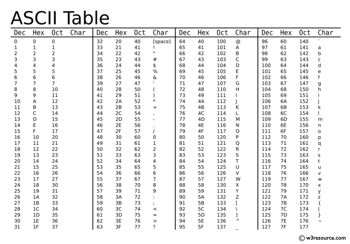

# W03 Notes // 09.10.19

## Warm up

### Q0.1

Write a program that reads three integers x, y and z. Then, the values of x, y and z are updated as follows:
     
     x = (x + y) * z
     y = (x * z^2) + y
     z = (z * 3 + y) - x

**Be careful about using the initial values of x, y, and z while calculating their new values.**
Print the new values of x, y, z.
     
    input: 2 3 5 
    output: 25 53 16

### Q0.2

Write a program to find the area and the circumference of a circle. Read $r$ from the user and define $pi$ as a constant variable. 

     pi = 3.14159
 
     input: 5 
     output:  Cir= 31. 41,   Are= 49.34
     
Print only two decimal points.


### Constant variable
```c
#define constant_name constant_value
```

### Operators: ( +=, -=, *=, /=)


```c
#include <stdio.h>

int main(){
	int x=5, y=3;
	 x +=y /* same as x = x + y */
	printf("x:%d\n",x);

	y *= x /* same as y = x * y */
	printf("y:%d x:%d\n",y,x);
    
	return 0;
}
```

### Operators: (++, --)

```c
#include <stdio.h>

int main(){
	int n = 5, x;
	n++;     /* n = 6 */
	printf("n:%d\n",n);
    // n = n+1 OR n += 1 OR n++

	x=n++; 
	printf("x:%d n:%d\n",x,n);
    /* equals to following two commands:
    * x = n;
    * n++;
    */
    
	
	x=n--;   
	printf("x:%d n:%d\n",x,n);
    /* equals to following two commands:
    * x = n;
    * n--;
    */  
    
    x=++n;   
	printf("x:%d n:%d\n",x,n
   /* equals to following two commands:
    * n++;
    * x = n;
    */  
    
    x=--n;   
	printf("x:%d n:%d\n",x,n);
   /* equals to following two commands:
    * n--;
    * x = n;
    */  
    
	
	return 0;
}
 ```

## Char Data Type (%c)

### [W3Schools](http://www.w3schools.com) is a good resource for programming! 




## Char is special!! It is a character and an integer at the same time!

```c
#include <stdio.h>

int main(){			
	int a=5002;
    
	char ch='0';  /* ASCII code of '0' is 48 */
	printf("ch:%c ascii of ch:%d\n",ch,ch);

	ch=ch+3;       /* ch = '3', ASCII code becomes 51 */
	printf("ch:%c ascii of ch:%d\n",ch,ch);
	
	a+=ch;        /* a = 5053 */
	printf("a:%d\n",a);

	ch+=a;        /* ch = ?, overflow and undefined behavior occurs */
	printf("ch:%c ascii of ch:%d\n",ch,ch);
	
	return 0;
}
 ``` 

### Q1
Write a program that reads a character variable from the user then prints the character and its ASCII code.

    input: x y z
    output: x 120, y ASCII, z ASCII

### Q2

Write a program which reads a lower-case char (character) from the user, then prints its upper-case version on the screen. 
  
       e.g. 
       input: b
       output: B 

### HW-1

Write a program that reads an upper case letter, then prints its position in the alphabet.

| INPUT      | OUTPUT    |         
| ---------  |:---------:| 
| A      | 1| 
| H     | 8| 


### HW-2

Write a program that reads two numeric **characters** and prints their multiplication.

| INPUT      | OUTPUT    |         
| ---------  |:---------:| 
| 9 8      | 72| 
| 1 3     | 3| 


```c
#include <stdio.h>

int main(){			
    
    char ch1, ch2;
    scanf("%c %c", &ch1, &ch2);
    
    /*
    *  YOUR SOLUTION HERE
    *
    */
	
	return 0;
}
 ```

