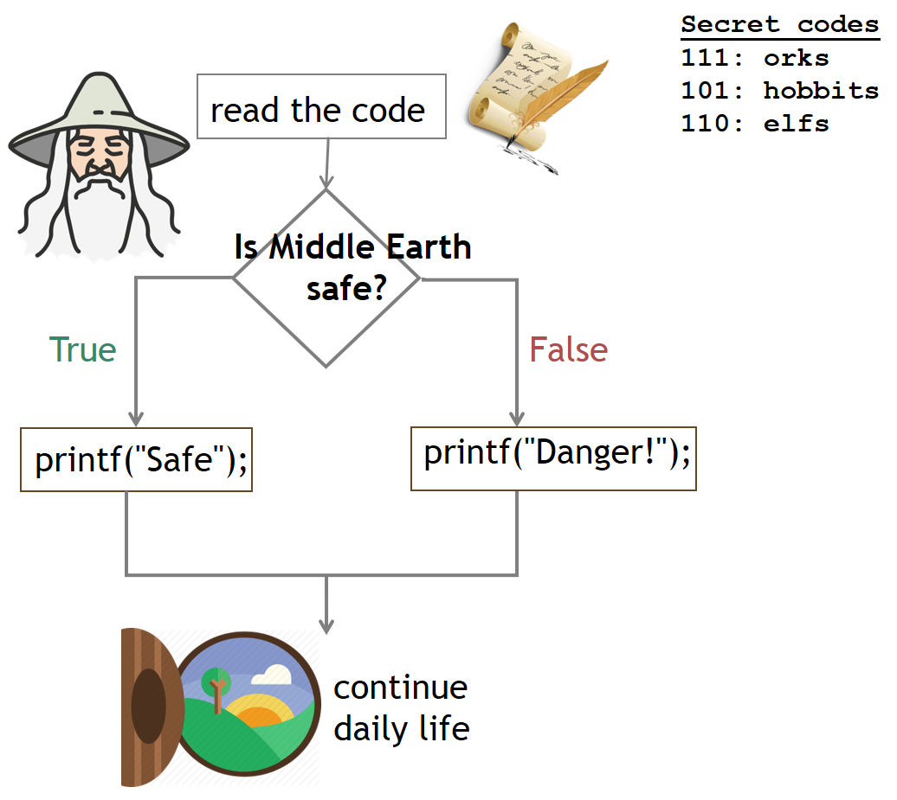

# W04 Notes // 16.10.19

## Warm up

### Q0.1

Write a program that reads an upper case letter, then prints its position in the alphabet.

| INPUT      | OUTPUT    |         
| ---------  |:---------:| 
| A      | 1| 
| H     | 8| 


### Q0.2

Write a program that reads two numeric **characters** and prints their multiplication.

| INPUT      | OUTPUT    |         
| ---------  |:---------:| 
| 9 8      | 72| 
| 1 3     | 3| 


```c
#include <stdio.h>

int main(){			
    
    char ch1, ch2;
    scanf("%c %c", &ch1, &ch2);
    
    /*
    *  YOUR SOLUTION HERE
    *
    */
	
	return 0;
}
 ```


## Control Statements: If-else, Switch case



#### Comparison operators

       <  :(less than)
       >  :(greater than)
       <= :(less than or equal to: ≤)
       >= :(greater than or equal to: ≥)
       !=    :(not equal to: ≠)
       ==    :(equal to: important! writing = instead of == is a common mistake)

### Q1

 Write a program to that reads three integers, in which first two integers are the components of a mathematical operation and the third  one indicates the operation itself. Print the result of the corresponding operation. 
 
     1: sum,  2: substract,  3: multiplication,  4: division    otherwise: error
 
| INPUT      | OUTPUT    |         
| ---------  |:---------:| 
| 34 7 2      | 27| 
| 12 8 3     |96| 
| 113 21 1 | 134|
| 113 21 9 | error|


### Switch Case

```c
#include <stdio.h>

int main(){			
    
 	int num1, num2, choice;
	scanf("%d%d%d",&num1, &num2, &choice);
	
	switch (choice){
		case 1: 
            printf("%d", num1+num2); 
            break;
		case 2: 
            printf("%d", num1-num2);
            break;
		case 3: 
            printf("%d", num1*num2);
            break;
		case 4: 
            printf("%d", num1/num2); 
            break;
        
		default: printf("error");
	}
    
    
    /* OR an alternative solution with the operator as a character:
    *
    *int num1, num2;
    *char choice;
	*scanf("%d%d %c",&num1, &num2, &choice);
	*
	*switch (choice){
	*	case '+': 
    *       printf("%d", num1+num2); 
    *        break;
	*	case '-': 
    *       printf("%d", num1-num2);
    *      break;
	*	case '*': 
    *        printf("%d", num1*num2);
    *        break;
	*	case '/': 
    *        printf("%d", num1/num2); 
    *        break;
    *    
	*	default: printf("error");
	}
    
	
	return 0;
}
 ```

### Q2

 Write a program to convert upper-case to lower-case and vice versa.
 
| INPUT      | OUTPUT    |         
| ---------  |:---------:| 
| d      | D| 
| H     | h| 
| 9 | digit|
| * |symbol|
    

### Q3
Read one character as input and check if it is a digit:
	   
       If so, convert it to an integer and display twice that number
	   o/w display an error message
       
| INPUT      | OUTPUT    |         
| ---------  |:---------:| 
| 9      | 18| 
| b     | error| 

### HW-1

Write a program that converts the time, which is given in seconds, to hh:mm:ss format.

    Note: If a value is smaller than 10, you must print 0 next to it. 
    i.e.: 9:3:45 is invalid, it must be 09:03:45 
    
    
   | INPUT      | OUTPUT    |         
  | ---------  |:---------:| 
  |18456     | 05:07:36 | 


### HW-2


Write a program that will take 2 numbers from the user:

- if the first number is divisible by the second number, your code should print "it is divisible",  

- if it is not divisible, then print "it is not divisible". 

- if one of your numbers is nonpositive, print "Incorrect input" 


    
| INPUT      | OUTPUT    |         
  | ---------  |:---------:| 
  |45 5      | divisible| 
  | 45 6     | not divisible  | 
  | -34 17    | incorrect input  | 


### HW-3

Write a program to read the three numbers from the user and find and display the largest number among them.

    input: 3 24 8
    output: 24
