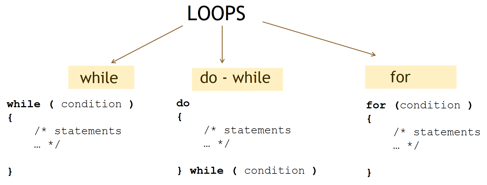

# W05 Notes // 23.10.19

## Warm up

### Q0.1


Write a program that will **read** 2 integers and 2 characters from the user:

- if the first number is divisible by the second number, your should perform the operation indicated with the first operator,  

- if it is not divisible, then print the result of the operation indicated with the second operator. 

- if one of your numbers is nonpositive, print "Incorrect input" 


| INPUT      | OUTPUT    |         
  | ---------  |:---------:| 
  |45 5 + *     | 50 | 
  |45 6 + -     | 39  | 
  |-34 17 * +   | incorrect input  | 

**Note:** Assume that for characters, only the following four operators will be used, +, -, *, /.

### Q0.2

Write a program to print the state of the weather based on the following conditions:

        - if smaller 21 Celcius degree -> cold
        - if between 21 - 25 Celcius degree -> warm
        - if bigger than 25 Celcius degree -> hot
        
Your program should read a character (F or C) and a float value from the user and perform a conversion if the degree is given in Fahrenheit (F). 
    
        F 77  means that you have to convert Fahrenheit 77 degrees to Celcius (25) degrees.
        
        Celcius = (Fahrenheit - 32) * 5 / 9

| INPUT      | OUTPUT    |         
  | ---------  |:---------:| 
  |F 77   | warm | 
  |C 32   | hot  | 
  |X 25  | incorrect input  | 


### Ternary operator

condition ? value_if_true : value_if_false
    
```c
#include <stdio.h>
int main(){	

    int a = 10, b = 20, c;
    c = (a < b) ? a : b;
    
    /*
        int a = 1, b = 2, ans;
        if (a == 1) {
            if (b == 2) {
                ans = 3;
            } else {
                ans = 5;
            }
        } else {
            ans = 0;
        }

       ans = (a == 1 ? (b == 2 ? 3 : 5) : 0);
    */

    return 0;
    
}
```

## Loops 



```c
#include <stdio.h>

int main(){			
    
    /* WHILE LOOP */
    i = 0;   // i is the loop control variable, initialize before using
    while ( i <= 10) // executes 0 or more times, each execution is called iteration
    {
        /* statements */ 
        i +=1; // do NOT forget to update the control variable

    } 
    
    /* FOR LOOP */
    int j; // declare the control variable
    for ( j = 0; j <= 10; j++)  // control variable initialization, control statement, and update
    {                         // in the same line 
        /* statements*/

    }
    
    /* DO-WHILE LOOP */
    int z=0; // initialize the control variable
    do  // executes 1 or more times!!
    {
        /* statements */
        z +=1;

    } while ( z <= 10 ) 

}
 ```


### Q1

Write a program that takes 2 integers a and b, then prints the result of a^b (power).

| INPUT      | OUTPUT    |         
| ---------  |:---------:| 
|    3 4  | 81 | 
|    2 10  | 1024 | 


### HW-1

Write a program that reads two characters and displays from first character to second **excluding vowels**.

    input: c p
    output: c d f g h j k l m n p
    
    input: p c
    output: p n m l k j h g f d c

### HW-2

Write a program that reads two numbers and prints the numbers that can be divided to 11 between them (including the numbers themselves)

| INPUT      | OUTPUT    |         
| ---------  |:---------:| 
|    11 77  | 11 22 33 44 55 66 77 | 
|    8 16 | 11  | 
|    2 7 |   | 

### HW-3

Write a program that will take an integer N, then prints N! (N factorial). 


| INPUT      | OUTPUT    |         
| ---------  |:---------:| 
| 5     | 120 | 
| 3     | 6 | 

