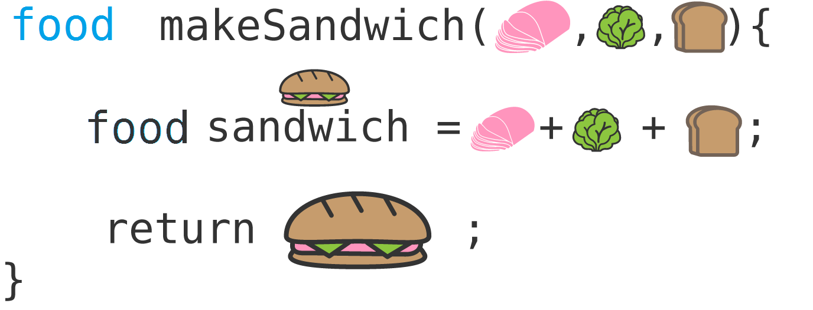
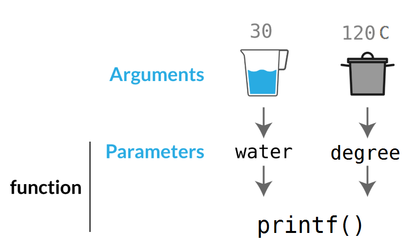

## W07 // 27.03.2019

## Functions 
[source here](https://www.codeanalogies.com/javascript-functions-explained)


### What is a function?
Let's think about the general concept of cooking with a recipe first. Using a recipe means that:

       You start with a specific set of ingredients
       You perform a specific procedure using those ingredients
       You will get a reliable product at the end
   
**A function is also a reusable recipe that performs the same set of actions over and over again on a set of ingredients.**

Those **ingredients** are called **parameters**. 



### Function types

       functions with RETURN -> create a new value
      
       functions WITHOUT return -> create a new format
 

### Void function

#### Example-1
```c
#include <stdio.h> 

// I am **declaring** a function. 
void boilWater() { // no parameters
    printf("Boiling water.");
}

int main(){
    boilWater(); // I am **calling** the function. 

    return 0;
}
```

#### Example-2

```c
#include <stdio.h> 
void boilWater(int water, float degree){  // I have two parameters
    printf("Boiling %d liters of water at %f C degree.", water, degree);
}

int main(){
    int water = 1;
    float deg = 120;
    boilWater(water, degree); // I am **sending arguments**. 

    return 0;
}

```



### Functions with return

#### Example-3

```c
#include <stdio.h> 
int divide(float num1, float num2){  // I have two parameters
    return num1/num2;
}

int main(){
    float a,b;
    scanf("%f%f", &a, &b);
    float result = divide(a, b); // I am **sending arguments**. 
    printf("%f", result);

    return 0;
}

```

 ### Q0.1
Write a function named **printAsTime** which reads hours, minutes, and seconds as three integers, 
then prints it to the screen as shown in the examples. 

    This function shouldn't return anything. 
     Assume no invalid input will be given (like 92 minutes or -2 hours). 
 
 | INPUT      | OUTPUT    |         
| ---------  |:---------:| 
| 5 12 3 | 05:12:03 | 
| 3 0 22     |  03:00:22 |  
 

 ### Q0.2

Write a function that takes an integer as a parameter and computes the factorial of that integer.

Write a program to compute  the summation of each digits' factorial using factorial function. 


| INPUT      | OUTPUT    |         
| ---------  |:---------:| 
| 4 | 24 | 
| 3     |  6 | 
| 43     | 30| 


### Q1
Write a function named **toUpper** which takes a char as input, and returns the upper case version of the character if it is a lower case letter. Otherwise it should return the same character. 

 Then write a program which reads a word from the user, and prints it with upper case characters. Assume valid words will be given. 
 
        !!!Your program should be terminated to be considered to be correct. 
        Any program that outputs the correct number but waits for another input from the user will be incorrect.!!!


| INPUT      | OUTPUT    |         
| ---------  |:---------:| 
| bogazici | BOGAZICI | 
| CmpE     |  CMPE | 
| HAGI     | HAGI| 

### Homework-1

Write a function **isPrime()** that checks whether the given number is prime. 

    The function returns 1 if the number is prime and returns 0 otherwise.

    Then write a program which takes an integer and prints all of its prime divisors. 
    Use  **isPrime()** function. 

| INPUT      | OUTPUT    |         
| ---------  |:---------:| 
| 12| 2 3  | 
| 21    |  3 7 | 


### Homework-2

Write a function that will take an integer N, and returns **T** if it's a perfect number. Otherwise the function should return **F**. 

    Perfect Number: a positive integer that is equal to the sum of its positive divisors excluding the number itself. 

     Then write main appropriately to see the result.
 
 | INPUT      | OUTPUT    |         
| ---------  |:---------:| 
| 4 | 24 | 
| 3     |  6 | 
| 43     | 30| 

###  Homework-3

Write a function named **fetchDigit** which takes two integers as input: **number** and **n**. 
Function should return the n.th digit (from the right) of the number as an integer. 
If the number is less than n digits, Function should return -1. 

 Then write a program which reads a positive integer z and another integer x, then print out the x.th digit of z. 
 If the input is incorrect (z doesn't have x digits), program should print "-1". 
  
    
| INPUT      | OUTPUT    |         
| ---------  |:---------:| 
| 23423 3      | 4| 
| 204612 5      | 0 | 
| 52 9      | -1| 

