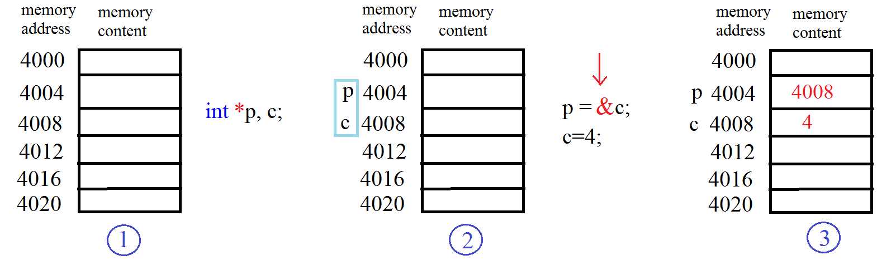
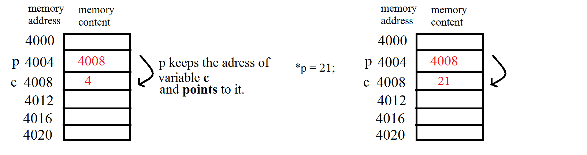
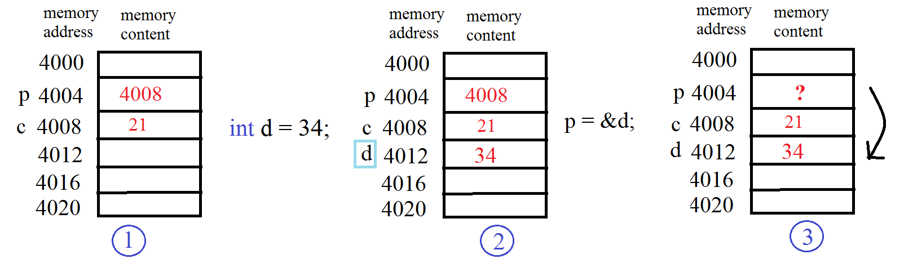

## W08 // 03.04.2019

###  Q0.1

Write a function named **fetchDigit** which takes two integers as input: **number** and **n**. 
Function should return the n.th digit (from the right) of the number as an integer. 
If the number is less than n digits, Function should return -1. 
   
    
| INPUT      | OUTPUT    |         
| ---------  |:---------:| 
| 23423 3      | 4| 
| 204612 5      | 0 | 
| 52 9      | -1| 

###  Q1

Write a function **decimalToBinary()** that will take an integer as a parameter.  Then calculates and returns its binary version as another integer. You might make use of your own **power** function.

Then write main appropriately to see the result. 

| INPUT      | OUTPUT    |         
| ---------  |:---------:| 
| 25     | 11001| 
| 532     |  1000010100  | 
| 5      | 101| 

## Pointers

### Declaring a pointer

### Updating  the value of the variable  pointer [ points to ]

### Updating the address (the variable) pointer [ points to ]

### Q2

Write a function named **cubeByReference()**

**cubeByReference** takes an integer pointer and computes the cube of the integer. (does not return anything.)

### Homework-1

Write a function named **swap** which takes two integer pointers (addresses of two integers) and swaps the values in those two addresses. 

In the main program, create two integer variables a and b, then read their values from the user. 

Print their values to the screen. Then call the swap function with the addresses of these two integers, and print their values again to see if they are really swapped. 

### Homework-2

Write a function named **divideWithRemainder** which takes two integer values: 

    number and divisor, and 
    two integer pointers (addresses of two integers): result and remainder. 
    
This function should divide the number by divisor, then write the result into the address given by result, and write the remainder into the address given by remainder. 

In the main program, create four integers: a,b,c,d. Then read the values of a and b from the user. Then call the function with the values of a and b, and the addresses of c and d, respectively. 

Your function will divide a by b, and the value of c will be the result, and the value of d will be the remainder. Then print out the values of c and d. 

Note that this function doesn't need to return anything, because it is already able to give output to the given addresses. 

Also note that, before calling a function with pointer inputs in the main program, you should first create appropriate variables so that you can give proper addresses to that function. 

