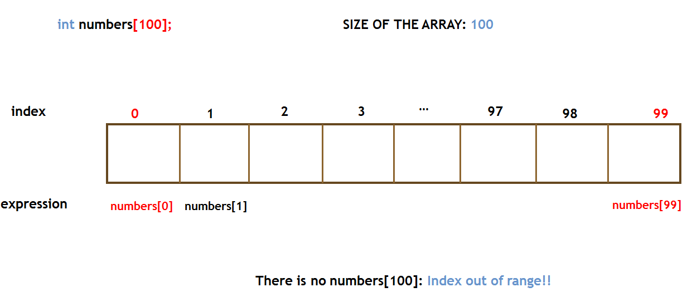
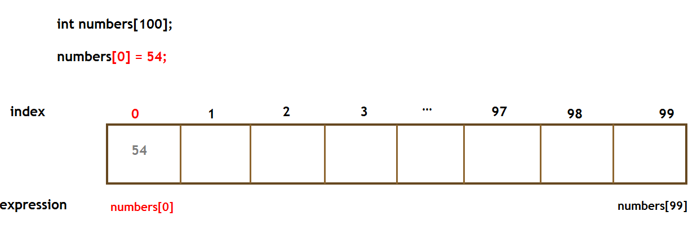
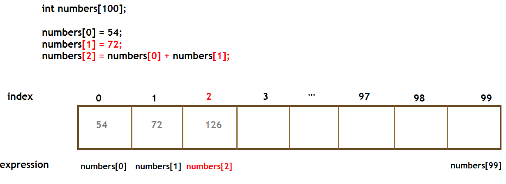

## W09 // 10.04.2019

### Q0.1

Write a function named **swap** which takes two integer pointers (addresses of two integers) and swaps the values in those two addresses. 

In the main program, create two integer variables a and b, then read their values from the user. 

Print their values to the screen. Then call the swap function with the addresses of these two integers, and print their values again to see if they are really swapped. 

### Q0.2

Write a function named **divideWithRemainder** which takes: 

    two integer parameters number and divisor, and 
    two integer pointers (addresses of two integers): result and remainder. 
    
This function should divide the number by divisor, then write the result into the address given by result, and write the remainder into the address given by remainder. 

    In the main program, create four integers: a,b,c,d. Then read the values of a and b from the user. Then call the function with the values of a and b, and the addresses of c and d, respectively. 

    Your function will divide a by b, and the value of c will be the result, and the value of d will be the remainder. Then print out the values of c and d. 

    Note that this function doesn't need to return anything!

## Arrays

### Inserting and element

### Inserting the result of an operation

### Q1 

Read 10 elements from the user and store them in an array. Then find largest and smallest elements of the array.

    input: 7 90 2 4 12 63 11 29 33 1
    output: Max:90 Min:1

### Q2

Write a program which reads an integer N from the user, then reads N integers from the user. Then your program should put these N integers into reverse order and print them to the screen. Assume N is smaller than 50. 

    input: 8
            1 2 4 3 5 6 8 7
    output: 7 8 6 5 3 4 2 1

### Homework-1

Write a program which reads a sentence from the user (read characters until '\n' appears). Your program then should put this sentence into a char array (assume the sentence will be shorter than 50 characters). 

     Encrypt this sentence by adding +1 to the value of each character. Then print the encrypted version to the screen. 

     Decrypt this sentence by adding -1 to each character, and print the decrypted version again to the screen. 

| INPUT      | OUTPUT    |         
| ---------  |:---------:| 
| Hello Bogazici     | Ifmmp!Cphb{jdj  Hello Bogazici | 
| Programming is fun   | Qsphsbnnjoh!jt!gvo   Programming is fun | 

**Fun Fact:** [Caesar Cipher](https://www.wikiwand.com/en/Caesar_cipher)

### Homework-2

Write a program which reads an integer N from the user, then reads N integers from the user. Compute the sum of the absolute value of the difference between each array element and its index.

    input:   10
            -3   -2   -1    0    1    2    3    4    5    6
    output: 30

### Homework-3

Write a program which reads an integer N from the user, then reads N integers from the user. Then program reads two more integers, low and high. Write a program that finds the largest element in a sub-array of an integer array. The sub-array consists of the array cells indexed between indices low and high, **inclusive**. 

    input:  12
            34   59   69   19   83   25   36   23   36   33 17   99
            3  8 
            
    output: 83

